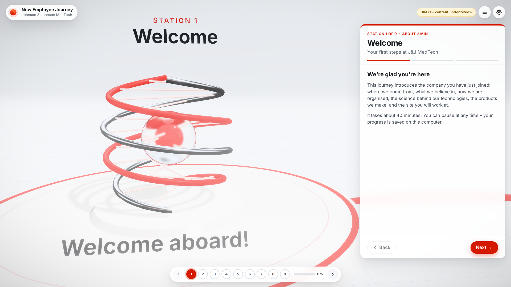
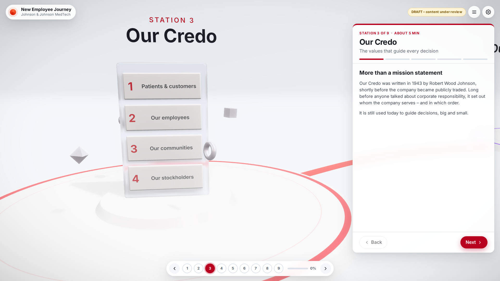
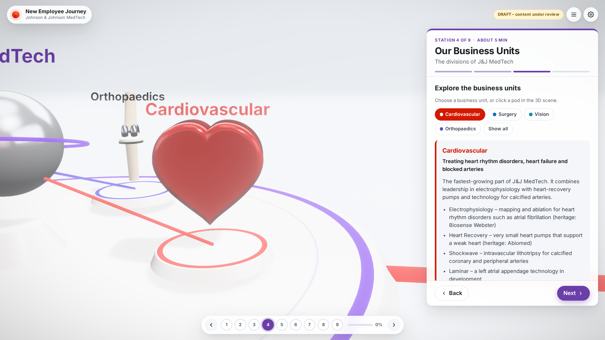
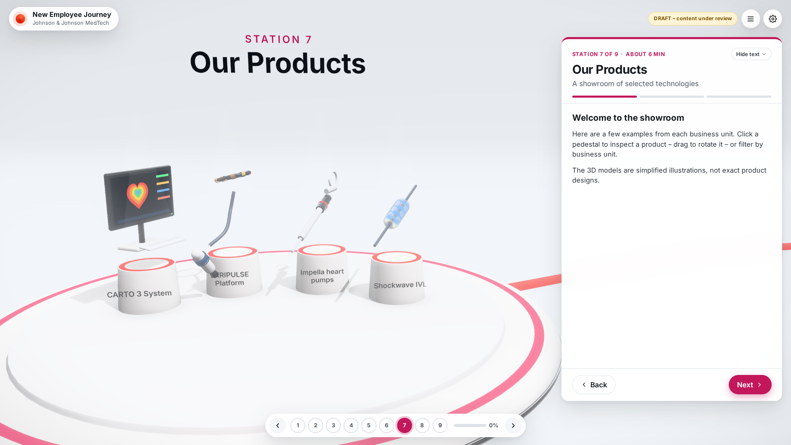
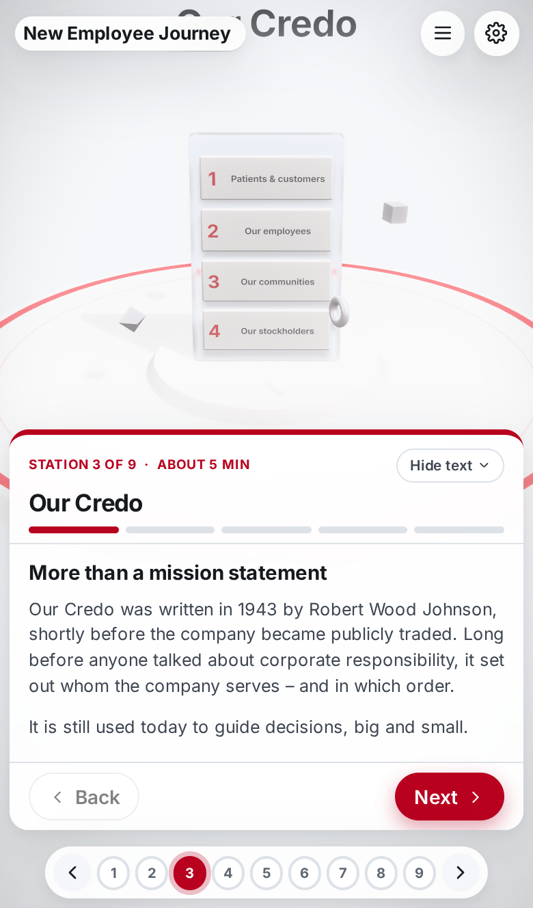
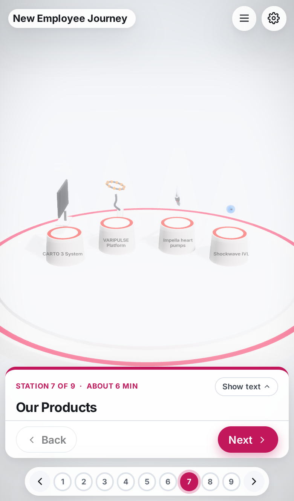

# J&J MedTech – New Employee Journey

A 3D onboarding experience for new employees, delivered as **one portable HTML file**.
The latest build is in [`release/`](release/). Copy it to a network drive or send it by email (zipped), then double-click it to open in Edge or Chrome.
It needs no installation and no internet connection.



## The journey

The new employee travels along a path through nine stations. Each station has short content cards, an interactive 3D "explore" page and a quick check question that unlocks the next station.

| # | Station | What you explore |
|---|---------|------------------|
| 1 | Welcome | Enter your name, learn how the journey works |
| 2 | Our Company | Rising 3D timeline of milestones since 1886 |
| 3 | Our Credo | Glass monolith with the four responsibilities |
| 4 | Our Business Units | Hub with Cardiovascular, Surgery, Vision and Orthopaedics |
| 5 | How We're Organised | Value chain from idea to patient, plus support functions |
| 6 | Technology & Science | Lab demos: lens optics, heart rhythm/ablation, knee replacement, product lifecycle |
| 7 | Our Products | Spotlit showroom, filterable by business unit |
| 8 | Our Site | 3D campus map with hotspots, safety essentials, contacts, first-week checklist |
| 9 | Knowledge Check | Quiz with pass mark and printable certificate |

| | |
|---|---|
|  |  |
|  |  |

Other features:

- **Progress is saved** in the browser on that computer, so employees can pause and resume. Nothing is sent anywhere.
- **Quality settings** (gear icon): *Auto* adapts to the computer; *High* renders at the screen's native resolution; *Ultra 4K* renders at least 3840 pixels wide.
- **Phones and tablets**: the text becomes a bottom sheet and the 3D scene moves into the space above it. **Hide text** shrinks the panel to its title and buttons so the 3D fills the screen (this also works on desktop).

  | | |
  |---|---|
  |  |  |

- **Accessibility**: keyboard navigation (← →, Esc), reduced-motion mode (follows the Windows setting), and a text-only mode. The text-only mode switches on automatically when the computer can't show 3D.
- **Draft badge**: shown while any content is marked `"draft"`, so nobody mistakes unreviewed text for approved material.

## Editing the text (no developer needed)

All texts live in a readable block at the top of the HTML file.

1. Make a copy of the file (keep the original as a backup).
2. Open the copy in **Notepad** and search for `EDITABLE CONTENT`.
3. Change only the text between double quotes. Keep quotes, commas and brackets as they are.
   - For a double quote inside a text, write `\"` (or use “ ”); for a line break, write `\n`.
4. Save the file and open it in the browser. If something is broken, the app lists exactly which field to fix.

Things you will want to fill in:

- **`"officialText"`** in the Credo station – paste the official Credo text from jnj.com or your internal source.
- **The Our Site station** – everything in `[brackets]` is a placeholder: site name, location, story, buildings (positions from -5 to 5 across and -3.5 to 3.5 deep), hotspots, contacts and checklist.
- **`"status"`** – change from `"draft"` to `"approved"` once Communications / Legal / Regulatory have reviewed a station.

For larger changes, developers can edit the source files in `src/content/` and rebuild. A build validates the content and fails with a clear message if something is wrong.

## Useful links

Add these to the file name when opening, e.g. `JnJ-MedTech-Onboarding-v0.1.0.html?preview`:

| Option | Effect |
|--------|--------|
| `?preview` | Unlock all stations (for trainers and reviewers) |
| `&station=products` | Open a specific station (use its `id`) |
| `&quality=ultra` | Force a quality level (`auto`, `high`, `ultra`) |
| `?textonly` | Start in text-only mode |
| `?debug` | Show a frame-rate meter |

## For developers

Requirements: Node 22.

```bash
npm install
npm run dev        # live development server
npm run build      # → dist/JnJ-MedTech-Onboarding-v<version>.html (single file, ~2 MB)
npm run typecheck && npm run lint && npm test
npm run e2e        # plays through the whole journey in the built file (after npm run build)
```

Stack: React 19, TypeScript, three.js with React Three Fiber and drei, postprocessing, zustand and zod. The build uses Vite with `vite-plugin-singlefile`. Fonts are bundled, and the lighting is generated in code (no HDR downloads), so the file makes no network requests.

```
src/content/        editable content (meta.json + one JSON per station) and its schema
src/scene/          3D world, camera, path and one component per station
src/scene/models/   simplified product and icon models built in code
src/ui/             panel, journey bar, menus, settings, quiz and certificate
src/state/store.ts  progress and settings (saved in the browser)
tools/content.ts    embeds the content block into the HTML at build time
tests/              unit tests (vitest) and end-to-end tests (Playwright)
```

Adding a real product model later: the models in `src/scene/models/models.tsx` are placeholders. Approved GLB files can be embedded and shown with drei's `useGLTF`. They are inlined into the single file, so keep them compressed and small.

## Content status and review

All content is a **draft** written from public sources (jnj.com, J&J press releases and SEC filings). The sources are listed in each station. Before rollout:

- Have Communications, Legal and Regulatory review the texts, product descriptions in particular.
- Replace the Our Site placeholders with real information.
- Add brand-approved logo, colours and fonts if desired (colours are in `src/theme/tokens.css`).

The 3D models are simplified illustrations, not exact product designs. Product names are trademarks of their respective owners.
